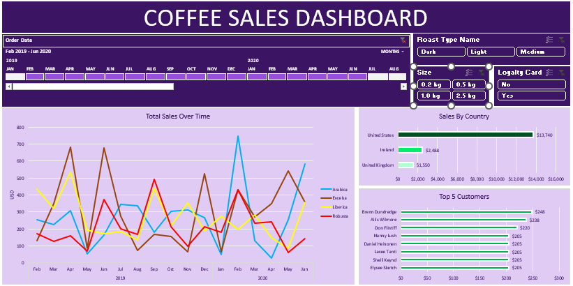

# ☕ Coffee Sales Dashboard

A fully interactive Excel dashboard for analyzing coffee sales from February 2019 to June 2020.
The dashboard includes filters, visual charts, and key performance insights to help explore trends,
customer behavior, and country-level sales.

## 📌 Features

### 1. Interactive Filters
- Order Date (timeline filter for months & years)
- Roast Type (Dark, Light, Medium)
- Size Options (0.2 kg, 0.5 kg, 1.0 kg, 2.5 kg)
- Loyalty Card (Yes / No)

### 2. Visual Insights
- Total Sales Over Time (line chart for Arabica, Excelsa, Liberica, Robusta)
- Sales by Country (United States, Ireland, United Kingdom)
- Top 5 Customers (ranked by total purchase value)

## 📊 Dashboard Overview
This dashboard helps users:
- Monitor sales performance across months
- Compare different coffee types
- Analyze country-level revenue
- Identify high-value customers
- Understand trends across time

## 🛠️ Tools Used
- Microsoft Excel
- PivotTables
- PivotCharts
- Slicers & Timelines
- Excel Formulas

## 📁 Files Included
- coffeeOrdersProject.xlsx
- coffeeOrdersData.xlsx

## 🎯 Purpose
This project is designed for learning and demonstrating:
- Data visualization in Excel
- Dashboard creation
- Sales analytics
- Interactive reporting

## 📸 Dashboard Screenshot
# Upload your screenshot to the repository and rename it:
# dashboard_screenshot.png

